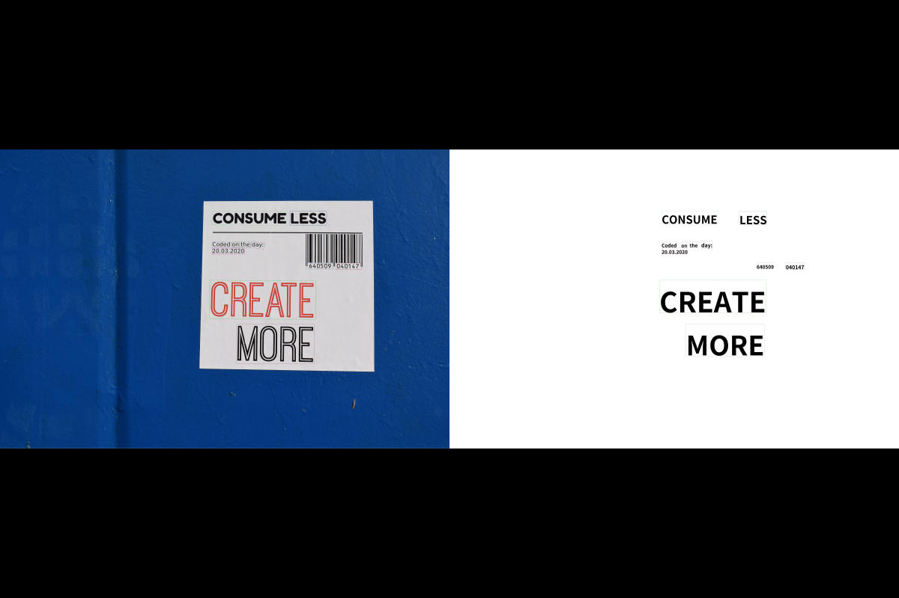

---
hide:
  - toc        # Hide table of contents
---

Every Subsection here, contains a specific setting in which Experiments were conducted and corresponding Results reported. All the results are Reproducible with their respective Jupyter Notebook/Colab link attached to it! 

## Default Configuration [:fontawesome-brands-github:](coming_soon.md)

=== "Example 1"
    !!! success "" 
        Python:
        ``` python linenums="1"
        from ucr import UCR
        ocr = UCR() # initialized with default parameters
        result = ocr('input', o='output', save_image=True) 
        ```
        CLI: `ucr predict 'input' -o 'output' --save_image True` 
    
    !!! info ""
        `lang`....<span style="color:#FF8856; font-style: italic">=="ch_sim"==</span>.... | `type`....<span style="color:#FF8856; font-style: italic">=="mobile"==</span>.... |
    {align="left"; loading="lazy"}

=== "Example 2"
    !!! success "" 
        Python:
        ``` python linenums="1"
        from ucr import UCR
        ocr = UCR() # initialized with default parameters
        result = ocr('input', o='output', save_image=True) 
        ```
        CLI: `ucr predict 'input' -o 'output' --save_image True` 
    
    !!! info ""
        `lang`....<span style="color:#FF8856; font-style: italic">=="ch_sim"==</span>.... | `type`....<span style="color:#FF8856; font-style: italic">=="mobile"==</span>.... |
    {align="left"; loading="lazy"}

=== "Example 3"
    !!! success "" 
        Python:
        ``` python linenums="1"
        from ucr import UCR
        ocr = UCR() # initialized with default parameters
        result = ocr('input', o='output', save_image=True) 
        ```
        CLI: `ucr predict 'input' -o 'output' --save_image True` 
    
    !!! info ""
        `lang`....<span style="color:#FF8856; font-style: italic">=="ch_sim"==</span>.... | `type`....<span style="color:#FF8856; font-style: italic">=="mobile"==</span>.... |
    {align="left"; loading="lazy"}

## Whitelist/Blacklist characters [:fontawesome-brands-github:](coming_soon.md)

=== "Without Whitelist"
    !!! success "" 
        Python:
        ``` python linenums="1"
        from ucr import UCR
        ocr = UCR() # initialized with default parameters
        result = ocr('input', o='output', save_image=True) 
        ```
        CLI: `ucr predict 'input' -o 'output' --save_image True` 
    
    !!! info ""
        `lang`....<span style="color:#FF8856; font-style: italic">=="ch_sim"==</span>.... | `type`....<span style="color:#FF8856; font-style: italic">=="mobile"==</span>.... |
    {align="left"; loading="lazy"}

=== "Whitelist 'en' Characters"
    !!! success "" 
        Python:
        ``` python linenums="1"
        from ucr import UCR
        import string 
        ocr = UCR(whitelist=string.printable[:-6])
        # this selects only the english characters, numbers and punctuations which is equivalent to 
        # whitelist='0123456789abcdefghijklmnopqrstuvwxyzABCDEFGHIJKLMNOPQRSTUVWXYZ!"#$%&\'()*+,-./:;<=>?@[\\]^_`{|}~'
        result = ocr('input', o='output', save_image=True) 
        ```
        CLI: `ucr predict 'input' -o 'output' --save_image True --whitelist "0123456789abcdefghijklmnopqrstuvwxyzABCDEFGHIJKLMNOPQRSTUVWXYZ!\"#$%&'()*+,-./:;<=>?@[\\]^_{|}~"`
    
    !!! info ""
        `lang`....<span style="color:#FF8856; font-style: italic">=="ch_sim"==</span>.... | `type`....<span style="color:#FF8856; font-style: italic">=="mobile"==</span>.... |
    {align="left"; loading="lazy"}

=== "Without Blacklist"
    !!! success "" 
        Python:
        ``` python linenums="1"
        from ucr import UCR
        ocr = UCR(l='en_number') # select language: 'en_number'
        result = ocr('input', o='output', save_image=True) 
        ```
        CLI: `ucr predict 'input' -o 'output' --save_image True -l 'en_number'` 
    
    !!! info ""
        `lang`....<span style="color:#FF8856; font-style: italic">=="en_number"==</span>.... | `type`....<span style="color:#FF8856; font-style: italic">=="mobile"==</span>.... |
    {align="left"; loading="lazy"}

=== "Blacklist Numbers"
    !!! success "" 
        Python:
        ``` python linenums="1"
        from ucr import UCR
        ocr = UCR(l='en_number', blacklist="0123456789") # blacklist numbers
        result = ocr('input', o='output', save_image=True) 
        ```
        CLI: `ucr predict 'input' -o 'output' --save_image True -l 'en_number' --blacklist '0123456789'` 
    
    !!! info ""
        `lang`....<span style="color:#FF8856; font-style: italic">=="en_number"==</span>.... | `type`....<span style="color:#FF8856; font-style: italic">=="mobile"==</span>.... |
    {align="left"; loading="lazy"}

## Mobile/Server Configuration [:fontawesome-brands-github:](coming_soon.md)

=== "Mobile Backend"
    !!! success "" 
        Python:
        ``` python linenums="1"
        from ucr import UCR
        ocr = UCR() # initialized with default parameters
        result = ocr('input', o='output', save_image=True) 
        ```
        CLI: `ucr predict 'input' -o 'output' --save_image True` 
    
    !!! info ""
        `lang`....<span style="color:#FF8856; font-style: italic">=="ch_sim"==</span>.... | `type`....<span style="color:#FF8856; font-style: italic">=="mobile"==</span>.... |
    {align="left"; loading="lazy"}


=== "Server Backend"
    !!! success "" 
        Python:
        ``` python linenums="1"
        from ucr import UCR
        ocr = UCR(type='server') # specified type="server"
        result = ocr('input', o='output', save_image=True) 
        ```
        CLI: `ucr predict 'input' -o 'output' --save_image True --type 'server` 
    
    !!! info ""
        `lang`....<span style="color:#FF8856; font-style: italic">=="ch_sim"==</span>.... | `type`....<span style="color:#FF8856; font-style: italic">=="mobile"==</span>.... |
    {align="left"; loading="lazy"}


## Multiple Language Support [:fontawesome-brands-github:](coming_soon.md)

=== "English 'en_number'"
    !!! success "" 
        Python:
        ``` python linenums="1"
        from ucr import UCR
        ocr = UCR(l='en_number') 
        result = ocr('input', o='output', save_image=True) 
        ```
        CLI: `ucr predict 'input' -o 'output' --save_image True -l 'en_number'` 
    
    !!! info ""
        `lang`....<span style="color:#FF8856; font-style: italic">=="en_number"==</span>.... | `type`....<span style="color:#FF8856; font-style: italic">=="mobile"==</span>.... |
    {align="left"; loading="lazy"}

=== "German 'de'"
    !!! success "" 
        Python:
        ``` python linenums="1"
        from ucr import UCR
        ocr = UCR(l='de')
        result = ocr('input', o='output', save_image=True) 
        ```
        CLI: `ucr predict 'input' -o 'output' --save_image True -l 'de'` 
    
    !!! info ""
        `lang`....<span style="color:#FF8856; font-style: italic">=="de"==</span>.... | `type`....<span style="color:#FF8856; font-style: italic">=="mobile"==</span>.... |
    {align="left"; loading="lazy"}

=== "French 'fr'"
    !!! success "" 
        Python:
        ``` python linenums="1"
        from ucr import UCR
        ocr = UCR(l='fr')
        result = ocr('input', o='output', save_image=True) 
        ```
        CLI: `ucr predict 'input' -o 'output' --save_image True -l 'fr'` 
    
    !!! info ""
        `lang`....<span style="color:#FF8856; font-style: italic">=="fr"==</span>.... | `type`....<span style="color:#FF8856; font-style: italic">=="mobile"==</span>.... |
    {align="left"; loading="lazy"}

=== "Japanese, 'ja'"
    !!! success "" 
        Python:
        ``` python linenums="1"
        from ucr import UCR
        ocr = UCR(l='ja')
        result = ocr('input', o='output', save_image=True) 
        ```
        CLI: `ucr predict 'input' -o 'output' --save_image True -l 'ja'` 
    
    !!! info ""
        `lang`....<span style="color:#FF8856; font-style: italic">=="ja"==</span>.... | `type`....<span style="color:#FF8856; font-style: italic">=="mobile"==</span>.... |
    {align="left"; loading="lazy"}

=== "Russian, 'ru'"
    !!! success "" 
        Python:
        ``` python linenums="1"
        from ucr import UCR
        ocr = UCR(l='ru') 
        result = ocr('input', o='output', save_image=True) 
        ```
        CLI: `ucr predict 'input' -o 'output' --save_image True -l 'ru'` 
    
    !!! info ""
        `lang`....<span style="color:#FF8856; font-style: italic">=="ru"==</span>.... | `type`....<span style="color:#FF8856; font-style: italic">=="mobile"==</span>.... |
    {align="left"; loading="lazy"}

=== "Korean, 'ko'"
    !!! success "" 
        Python:
        ``` python linenums="1"
        from ucr import UCR
        ocr = UCR(l='ko') 
        result = ocr('input', o='output', save_image=True) 
        ```
        CLI: `ucr predict 'input' -o 'output' --save_image True -l 'ko'` 
    
    !!! info ""
        `lang`....<span style="color:#FF8856; font-style: italic">=="ko"==</span>.... | `type`....<span style="color:#FF8856; font-style: italic">=="mobile"==</span>.... |
    {align="left"; loading="lazy"}

