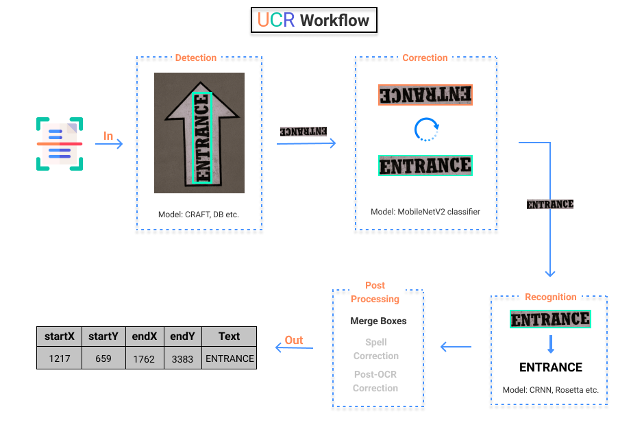

- [TL;DR](tldr.md): Jump right into action by running pretrained models using CLI or Python scripts.
- [Installation](tldr/#setup): Installation guide for Windows, Linux and Mac systems using pip or Docker containers.
- [Tutorials](coming_soon.md): Find in-depth explanations of config parameters and Deep Learning components as well as training and testing scripts through Jupyter Notebooks.
- [How to Contribute!](coming_soon.md): Learn how you can extend this library using custom trained models, datasets, new language support and/or new deep learning component(s).
- [Reference](coming_soon.md): Detailed documentation of each Python file in [UCR Repository](https://github.com/DocYard-ai/UCR/tree/develop/ucr) with its respective functions and classes.

## About
UCR  is an <u>Open Source</u>, <u>Easy to use</u> Python library to build <u>Production Ready</u> **[OCR](https://en.wikipedia.org/wiki/Optical_character_recognition)** applications with its highly &nbsp;Intuitive, &nbsp;Modular&nbsp; & &nbsp;Extensible <u>API design</u> and off-the-shelf **[Pretrained Models](pretrained.md)** for over 25 languages.  

## Features

<ul class="task-list">
    <li class="task-list-item">
        <label class="task-list-control">
            <input type="checkbox" disabled checked="">
            
        </label>
        &nbsp;Supports SOTA Text Detection and Recognition models 
    </li>
    <li class="task-list-item">
        <label class="task-list-control">
            <input type="checkbox" disabled checked="">
            
        </label>
        &nbsp;Built on top of Pytorch and Pytorch Lightning
    </li>
    <li class="task-list-item">
        <label class="task-list-control">
            <input type="checkbox" disabled checked="">
            
        </label>
        &nbsp;Supports over 25 languages
    </li>
    <li class="task-list-item">
        <label class="task-list-control">
            <input type="checkbox" disabled checked="">
            
        </label>
        &nbsp;Model Zoo contains 27 Pretrained Models across 25 languages
    </li>
    <li class="task-list-item">
        <label class="task-list-control">
            <input type="checkbox" disabled checked="">
            
        </label>
        &nbsp;Modular Design Language allows Pick and Choose of different components
    </li>
    <li class="task-list-item">
        <label class="task-list-control">
            <input type="checkbox" disabled checked="">
            
        </label>
        &nbsp;Easily extensible with Custom Components and attributes
    </li>
    <li class="task-list-item">
        <label class="task-list-control">
            <input type="checkbox" disabled checked="">
            
        </label>
        &nbsp;Hydra config enables Rapid Prototyping with multiple configurations
    </li>
    <li class="task-list-item">
        <label class="task-list-control">
            <input type="checkbox" disabled checked="">
            
        </label>
        &nbsp;Support for Packaging, Logging and Deployment tools straight out of the box
    </li>
</ul>
!!! note "" 
    <u>Note:</u> Some **features** are still in active development and might not be available!

## Workflow

Execution flow of UCR is displayed above. Broadly it can be divided into 4 sub-parts:

1. Input (image/folder path or web address) is fed into the <u>Detection</u> model which outputs bounding box coordinates of all the text boxes.
2. The detected boxes are then checked for <u>Orientation</u> and corrected accordingly.
3. Next, <u>Recognition</u> model runs on the corrected text boxes. It returns bounding box information and OCR output.
4. Lastly, an optional <u>Post Processing</u> module is executed to improve/modify the results.

&nbsp;&nbsp;&nbsp;&nbsp;&nbsp;&nbsp; Click [Here](tldr/#run-prediction) to get started with the Code!

## Acknowledgement

Substantial part of the UCR library is either inspired or inherited from the [PaddleOCR](https://github.com/PaddlePaddle/PaddleOCR) library. Wherever possible the repository has been ported from PaddlePaddle to PyTorch framework including the direct translation of model parameters.
Also, a big thanks to [Clova AI](https://clova.ai/en/research/research-areas.html), for open sourcing their testing script and pretrained models ([CRAFT](https://github.com/clovaai/CRAFT-pytorch)).  
A complete list of the Implemented Models along with their respective citation is tabulated [here](coming_soon.md)!